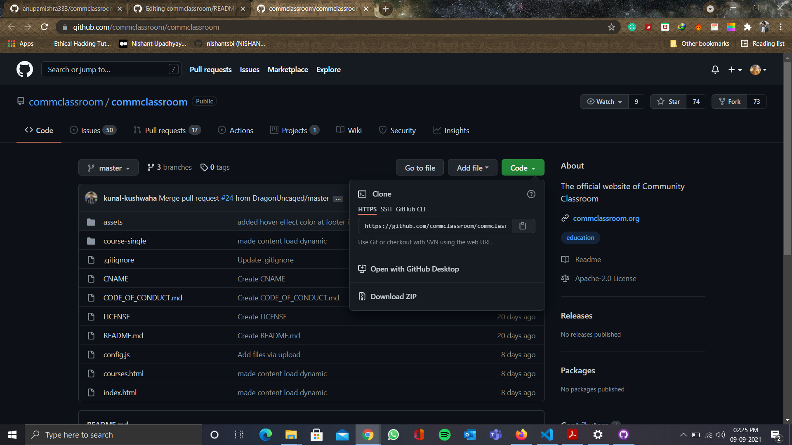

# Community Classroom Website

To start contributing, follow the below guidelines:

**1.** Fork [this](https://github.com/commclassroom/commclassroom) repository.

**2.** Clone your forked copy of the project.

```
git clone https://github.com/<your_user_name>/commclassroom.git

```



**3.** Navigate to the project directory :file_folder: .

```
cd commclassroom
```

**4.** Add a reference(remote) to the original repository.
```
git remote add upstream https://github.com/commclassroom/commclassroom.git
```

**5.** Check the remotes for this repository.

```
git remote -v
```

**6.** Always take a pull from the upstream repository to your master branch to keep it at par with the main project(updated repository).

```
git pull upstream main
```

**7.** Create a new branch.

```
git checkout -b <your_branch_name>
```
