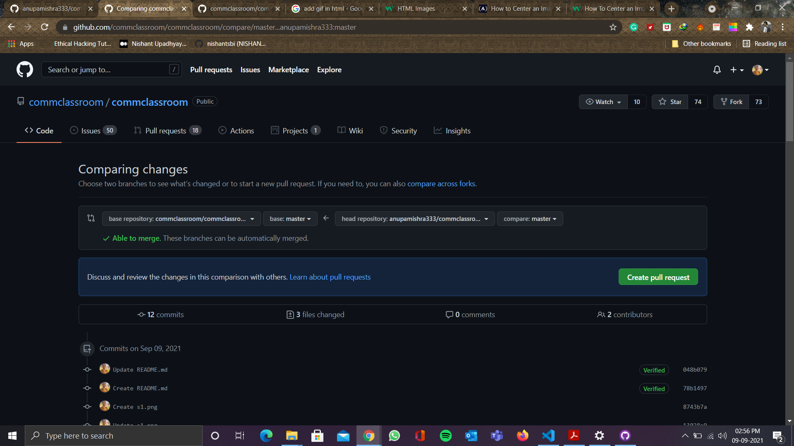
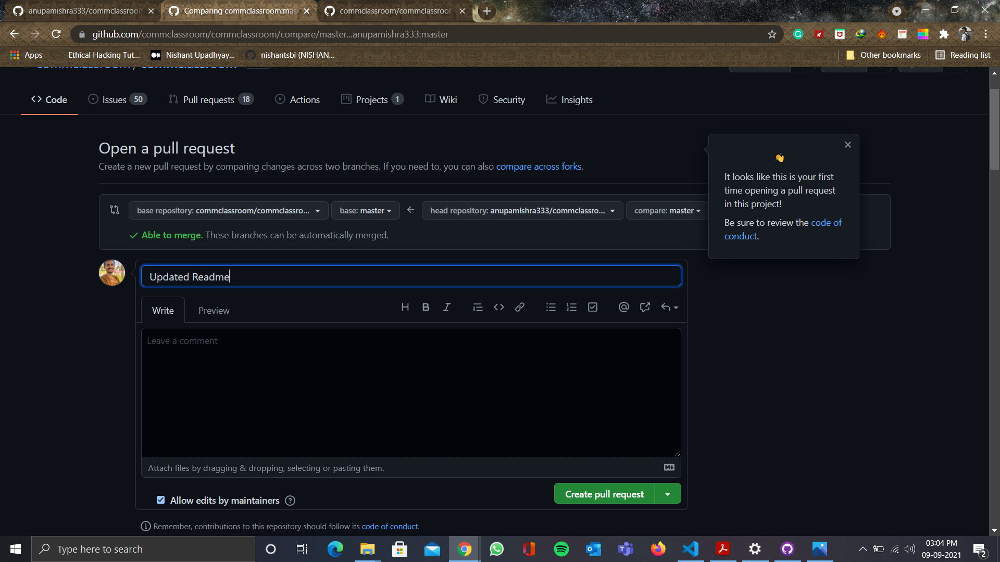

# Community Classroom Website

To start contributing, follow the below guidelines:

**1.** Fork [this](https://github.com/commclassroom/commclassroom) repository.

**2.** Clone your forked copy of the project.

```
git clone https://github.com/<your_user_name>/commclassroom.git

```


**3.** Navigate to the project directory :file_folder: .

```
cd commclassroom
```

**4.** Add a reference(remote) to the original repository.
```
git remote add upstream https://github.com/commclassroom/commclassroom.git
```

**5.** Check the remotes for this repository.

```
git remote -v
```

**6.** Always take a pull from the upstream repository to your master branch to keep it at par with the main project(updated repository).

```
git pull upstream main
```

**7.** Create a new branch.

```
git checkout -b <your_branch_name>
```

**8.** Perform your desired changes to the code base.

<p align="center"></p>

**9.** Track your changes:heavy_check_mark: .

```
git add .
```

**10.** Commit your changes
```
git commit -m "Relevant message"
```

**11.** Push the committed changes in your feature branch to your remote repo.

```
git push -u origin <your_branch_name>
```

**12.** To create a pull request, click on `compare and pull requests. Please ensure you compare your feature branch to the desired branch of the repo you are supposed to make a PR to.



**13.** Add appropriate title and description to your pull request explaining your changes and efforts done.

**14.** Click on `Create Pull Request`.



**15** Voila :exclamation: You have made a PR to the Vaccine-Tracker-App project :boom: Sit back patiently and relax while the project maintainers review your PR. Please understand at times the time can vary from a few hours to a few days.

<div style="width:100%;height:0;padding-bottom:76%;position:relative;"><iframe src="https://giphy.com/embed/3o6ZsZbUukGiYMf2a4" width="100%" height="100%" style="position:absolute" frameBorder="0" class="giphy-embed" allowFullScreen></iframe></div><p><a href="https://giphy.com/gifs/southparkgifs-3o6ZsZbUukGiYMf2a4">via GIPHY</a></p>


